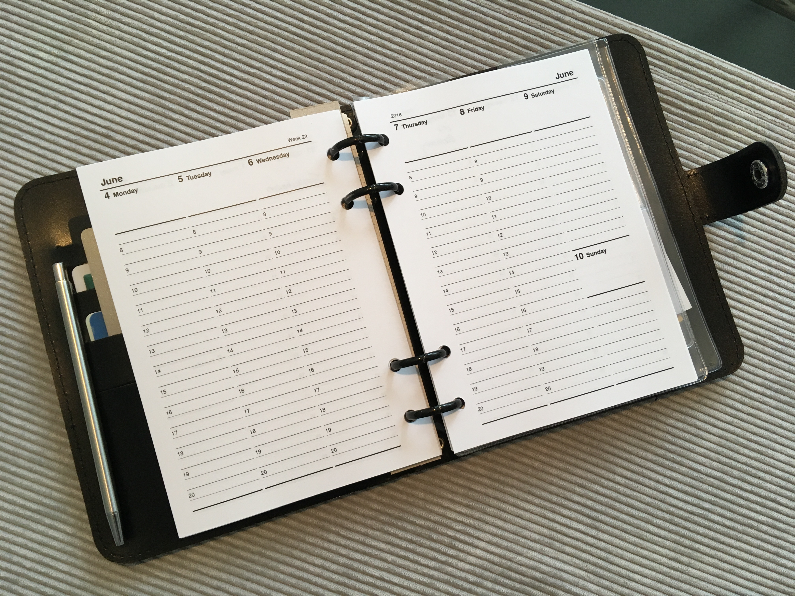

## Custom A4/A5 Calendar Inlays using LaTeX

Based on: [https://tex.stackexchange.com/questions/220980/organiser-refills-inlays-using-latex](https://tex.stackexchange.com/questions/220980/organiser-refills-inlays-using-latex)

Created on macOS High Sierra 10.13.2

**Dependencies** (install with `npm install` once you have Homebrew):
* [Homebrew](https://brew.sh/)
* Python 2.7
* [Basictex](http://www.tug.org/mactex/morepackages.html)
* Tex Live Packages: `tabularx`, `booktabs`, `multirow`, `helvetic`

Calendar configured for 2019. See top of `script.py`.
